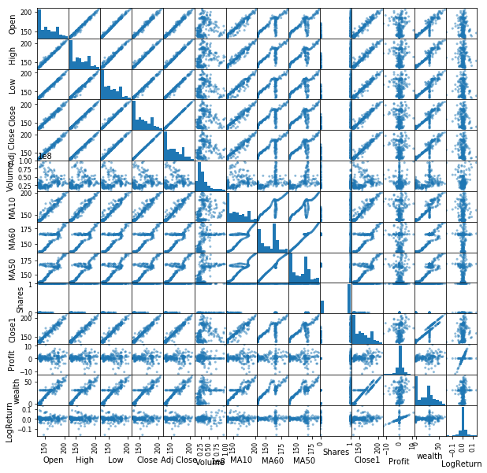

# Ronit Portfolio
## [Project 1: Market Analysis using Machine Learning](https://github.com/rontik2002/Stock_Market_Analysis_Machine_Learning.git)
### Algorithm Description
* Using 5000 nodes in RandomForest Decision Trees to predict the return of a price of the stock over the next five years (UNDERPERFORM, ABOVE 100%, ABOVE 200%, ABOVE 300% and  ABOVE 400%)
* Using 6 input variables measuring earnings, debt, assets and industry. 

### Results
* Provided a ≈45% hit rate on the predicted return of all stocks in the S&P 500 between AUG 2016 - AUG 2021
* Predicted ≈75% of all underperforming  of companies in the S&P 500 between AUG 2016 - AUG 2021
* Ensured an 80%+ hit rate on Above 400% prediction to outperform the market (100%+ returns) between AUG 2016 - AUG 2021
* Assesed the financial standing of the S&P 500 components and created a list of stocks expected to underperform, and beat the market over the next 5 years. Click 
[here](https://github.com/rontik2002/Stock_Market_Analysis_Machine_Learning/blob/main/countOfPredictedValues.xlsx) to see the excel sheet for the predictions in the S&P 500, and [here](https://github.com/rontik2002/Stock_Market_Analysis_Machine_Learning/blob/main/countOfPredictedValuesIndia.xlsx) for predictions in the S&P BSE 500.

## [Project 2: Dollar Neutral Portfolio](https://github.com/rontik2002/Dollar_Neutral_Portfolio.git)
* Created an algorithm to produce a Dollar Nuetral Portfolio using Beta, Stock Price (1 Yr) and Price to Book ratio.
  * A Dollar Nuetral Portfolio is a portfolio management concept, in which there is equal investment in long and short positions based on price volatility of a security.
  * According to "The Street View - How Design Choices Impact Low Factor Risk Performance" by TwoSigma, the Dollar Nuetral Portfolio would outperform all other portfolios in a situation similar to that of the March 2020 stock market crash. 
* Scraped data for all stocks in the S&P 500 using Python and Selenium.
* Graphed the distribution of beta and price to book ratio to identify Gaussian distribution and derive the individual z-scores for each security. 
* Used pandas to weigh the z-scores to create a list of 18 stocks, each differently weighted, and equal investments in Long and Short positions.

## [Project 3: Yahoo Finance Web Scraper](https://github.com/rontik2002/Yahoo_Finance_Webscraper.git)
* Scraped the Yahoo Finance and MarketWatch websites using python and selenium 
* Extracts the stock price, currency, company description and financial statements of any company desired by the user
* Created a concise financial statement table, which is readable and informative
* Produced the financial information in an extractable format for excel users. 

## [Project 4: Data Analysis Workshop](https://github.com/rontik2002/Data_Analysis_Workshop.git)
* Presented a data analysis workshop to undergraduate students
* Backtested a 50 day moving average strategy for a particular stock
* Demonstrated the cumulative profits made on a time-series chart using python and matplotlib

